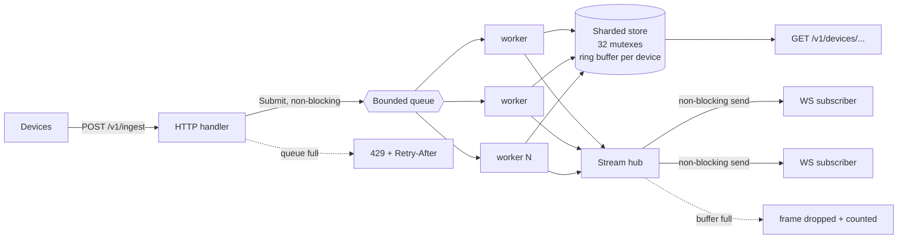

<h1 align="center">pulse</h1>

<p align="center">
  <strong>A device telemetry ingest service in Go.</strong><br>
  Fixed memory, bounded queue, live WebSocket fan-out.
</p>

<p align="center">
  <a href="https://github.com/Ohimoiza1205/pulse/actions/workflows/ci.yml">
    
  </a>
  
  
  
  
  <a href="LICENSE"></a>
</p>

---

## The problem

A fleet sends more than you can process. Something has to give. Most services
decide this by accident: an unbounded channel grows until the kernel OOM-kills
the process, or a slow consumer backs up the write path until healthy clients
time out too.

`pulse` decides on purpose. Load is shed at the edge with a status code the
client can act on, memory is bounded by construction rather than by hope, and
every degradation is a counter you can alert on.

## Quickstart

```bash
git clone https://github.com/Ohimoiza1205/pulse.git
cd pulse
make run                 # listens on :8080
```

In a second shell:

```bash
# push a reading
curl -X POST localhost:8080/v1/ingest \
  -H 'Content-Type: application/json' \
  -d '{"device_id":"dev-00001","metric":"engine_temp_c","value":91.4}'

# read it back
curl localhost:8080/v1/devices/dev-00001/latest

# simulate 500 devices at 2 Hz for 30 seconds
make load

# watch queue depth, shed count, and subscribers
curl localhost:8080/v1/stats
```

Live feed, whole fleet or one device:

```bash
websocat ws://localhost:8080/v1/stream
websocat 'ws://localhost:8080/v1/stream?device=dev-00001'
```

## API

| Method | Path | Description |
|---|---|---|
| `POST` | `/v1/ingest` | Accept one reading, an array, or `{"readings":[...]}` |
| `GET` | `/v1/devices` | Fleet roster |
| `GET` | `/v1/devices/{id}/latest` | Most recent reading for a device |
| `GET` | `/v1/devices/{id}/series?window=5m&limit=100` | Retained history, oldest first |
| `GET` | `/v1/stream?device={id}` | WebSocket feed, `device` optional |
| `GET` | `/v1/stats` | Queue depth, shed count, delivery counters |
| `GET` | `/healthz` | Liveness |

**Ingest responses**

| Status | Meaning |
|---|---|
| `202 Accepted` | At least one reading was queued. Body reports `accepted`, `invalid`, `shed`. |
| `429 Too Many Requests` | Queue saturated, nothing accepted. `Retry-After` header set. |
| `400 Bad Request` | Body was not valid JSON in any accepted shape. |

A batch with some invalid readings still returns `202`. Invalid entries are
counted, not fatal: one malformed sample from one device should not reject the
other nineteen in the payload.

## Architecture



Three boundaries, three failure modes, each handled explicitly.

## Design decisions

### The ingest queue is bounded, and a full queue returns 429

An unbounded channel turns a traffic spike into an out-of-memory kill. A bounded
one turns it into a status code the client can retry.

`Submit` uses a non-blocking send, so a saturated pipeline never holds an HTTP
connection open waiting for room. Without that, backpressure gets expressed as
connection timeouts, and the client's timeout config ends up deciding your
shedding policy for you.

Shedding at the edge is also the cheapest place to shed: the reading is dropped
before it costs a lock acquisition, a store write, or a fan-out pass.

```go
func (p *Pipeline) Submit(r telemetry.Reading) bool {
    select {
    case p.queue <- r:
        p.accepted.Add(1)
        return true
    default:
        p.shed.Add(1)
        return false
    }
}
```

### Retention is per device, not global

Each device gets a fixed-size ring buffer. Memory is
`devices × retain × sizeof(Reading)` and nothing else.

The alternative, a single global buffer, has a failure mode that only shows up
in production: one device stuck in a reboot loop emits at 100x the normal rate
and silently evicts the history of every other device in the fleet. Per-device
bounds make that impossible.

Appends are constant time with zero heap allocations.

### A slow WebSocket client drops frames instead of stalling ingest

Each subscriber has a buffered channel. `Broadcast` uses a non-blocking send.

A dashboard on hotel wifi loses samples. It does not back up the ingest workers
behind it. Losing a frame for one viewer beats stalling ingestion for the whole
fleet, and the drops are counted so degraded delivery is visible in `/v1/stats`
rather than silent.

### Concurrency

The store is sharded across 32 mutexes keyed by a hash of device ID, so writes
from unrelated devices never contend. Ingest is a worker pool over one bounded
channel.

Shutdown is ordered and the order matters:

1. Stop accepting HTTP
2. Drain the queue
3. Disconnect stream subscribers

Reversing steps 1 and 2 drops work the service already told a client it had
accepted with a `202`.

## Benchmarks

Single vCPU, Go 1.22, `-benchtime=2s`:

```
BenchmarkStoreAppend           41.09 ns/op     0 B/op    0 allocs/op
BenchmarkStoreAppendParallel  427.30 ns/op    41 B/op    1 allocs/op
BenchmarkStoreLatest           26.70 ns/op     0 B/op    0 allocs/op
```

End to end, with the load generator competing for the same single core:

| Devices | Rate | Duration | Readings | Shed | Failed |
|---|---|---|---|---|---|
| 2,000 | 5 Hz | 20s | 179,900 | 0 | 0 |

Backpressure verified by starving the service on purpose. With `-queue=4
-workers=1` under the same load it accepted 11,475 readings and shed 34,425,
with flat memory and no dropped connections.

Reproduce both:

```bash
make bench
make run &
go run ./cmd/loadgen -devices=2000 -hz=5 -batch=10 -duration=20s
```

## Configuration

| Flag | Default | Description |
|---|---|---|
| `-addr` | `:8080` | Listen address |
| `-queue` | `8192` | Bounded ingest queue size |
| `-workers` | `NumCPU × 2` | Ingest worker count |
| `-retain` | `720` | Readings retained per device |
| `-drain` | `15s` | Max time to drain in-flight work on shutdown |

Sizing `-retain`: at 720 readings per device and roughly 80 bytes per reading,
10,000 devices costs about 576 MB. Halve the retention or shard across
instances above that.

## Testing

```bash
make test     # go test -race ./...
make cover    # 84.9% of statements
make bench
make vet
```

Every test runs under the race detector, including two that exist specifically
to catch concurrency regressions:

- `TestStoreConcurrentAppend` runs 64 writer goroutines against 8 concurrent
  readers. It is the reason the store is sharded.
- `TestSlowConsumerDropsInsteadOfBlocking` asserts `Broadcast` completes while a
  subscriber never drains its channel. It fails if anyone makes that send
  blocking.

## Project layout

```
cmd/pulsed             server binary
cmd/loadgen            simulated device fleet
internal/telemetry     reading model, sharded store, ring buffers
internal/ingest        bounded queue, worker pool, backpressure
internal/stream        subscriber hub, non-blocking fan-out
internal/httpapi       routes, handlers, WebSocket upgrade
```

Routing uses the standard library `http.ServeMux` method and wildcard patterns
introduced in Go 1.22. The only third-party dependency is `gorilla/websocket`.

## Deploy

```bash
make docker
docker run -p 8080:8080 pulse:latest -queue=16384 -workers=8
```

The image is distroless and runs as nonroot. The final layer carries a static
binary and nothing else.

## What this is not

Not a time-series database. Retention is a fixed in-memory window, and a restart
loses it. The intended shape is a hot buffer in front of durable storage, where
the durable write is another consumer of the same fan-out.

Not authenticated. It assumes a gateway in front of it terminating TLS and
handling device identity.

## License

MIT. See [LICENSE](LICENSE).
